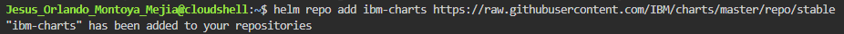

# Despliegue del Runtime de aplicaciones Open Liberty usando Helm en el servicio de Kubernetes en IBM Cloud (IKS)

1. Iniciamos sesión en [IBM Cloud](cloud.ibm.com)

2. En una nueva pestaña abrimos una sesión de [IBM Cloud Shell](cloud.ibm.com/shell).


3. En el menu hamburguesa, seleccionamos Kubernetes y clusters.


4. Nos redireccionará a la lista de clusters, ahí seleccionamos el cluster en el que vamos a trabajar, iks-demo.<br> En el panel lateral izquierdo presionamos la pestaña access y copiamos el comando de acceso:

`ibmcloud ks cluster config --cluster bl1gdkaw09sj8dmer1cg`


5. En nuestra IBM Cloud Shell pegamos el comando y lo ejecutamos.


6. Podemos verificar el acceso a nuestro cluster por medio del comando:

`kubectl config current-context`

Deberá aparecer el nombre de nuestro cluster y su ID.


7. Por motivos de orden crearemos un namespace usando el comando:

`kubectl create namespace <nombre-namespace>`

**NOTA**: Utilice su nombre en el campo de nombre.


9. Definimos el espacio de nombres, creado en el paso anterior, como espacio de nombres por defecto para todos los comandos.

`kubectl config set-context --current --namespace=<nombre-namespace>`


10. Inicializamos los componentes de Helm en nuestro repositorio ejecutando el comando

`helm init`


11. Añadimos los permisos a nuestra sesión de IBM Cloud Shell con el comando:

`kubectl create clusterrolebinding tiller --clusterrole=cluster-admin --serviceaccount=kube-system:default -n kube-system`


En caso de aparecer `Error from server (AlreadyExists)` continuar con los siguientes pasos, los permisos ya han sido otorgados anteriormente.

12. Agregamos el repositorio de Helm Charts de IBM usando el comando

`helm repo add ibm-charts https://raw.githubusercontent.com/IBM/charts/master/repo/stable`



13. Instalamos nuestro runtime de Open Liberty en nuestro cluster.

```sh
helm install ibm-charts/ibm-open-liberty \
--set image.repository=us.icr.io/helm-test/system \
--set image.tag=1.0-SNAPSHOT \
--set image.pullSecret=default-us-icr-io \
--set service.name=system-service \
--set service.port=9080 \
--set service.targetPort=9080 \
--set ssl.enabled=false
```

14. Una vez instalado nuestro chart, verificamos que el chart esté enlistado con el comando:

`helm ls`

15. Verificamos que se haya creado el pod y su estado sea READY

`kubectl get pods`

16. Con el pod en Estado READY podemos consultar la IP y el puerto de nuestro despliegue:

```sh
# Puerto
kubectl get service system-service -o jsonpath="{.spec.ports[0].nodePort}"
# IP
ibmcloud ks workers --cluster cluster-prueba
```

17. Colocamos en el navegador, la barra de direcciones, nuestra IP y nuestro puerto en el siguiente formato **IP : PUERTO**. Por ejemplo, http://169.47.168.99:32301/ para ver el home de nuestro Open Liberty.
